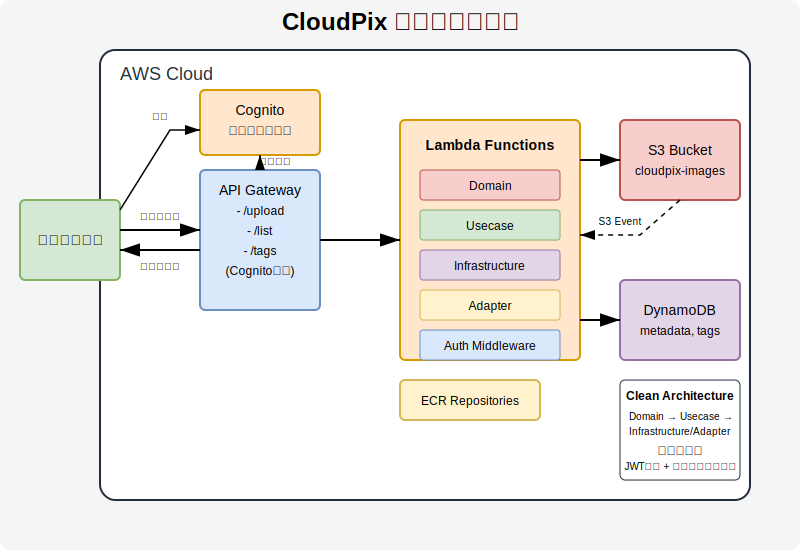

# CloudPix - サーバーレス画像管理システム

CloudPixは、AWSのサーバーレスサービスを活用した画像アップロードと管理を行うシステムです。画像のアップロード、保存、メタデータ管理、一覧取得、自動サムネイル生成に加え、画像へのタグ付けと検索機能を備えています。

## アーキテクチャ図



## 必要なライブラリとツール

このプロジェクトを実行するには、以下のツールが必要です：

- **AWS CLI** - AWSリソースの操作とAPI呼び出し用
- **Go** - Goプログラミング言語（バージョン1.22以上推奨）
- **go.uber.org/mock/mockgen** - テスト用モックコード生成ツール
- **jq** - JSONデータ処理ツール
- **make** - Makefileからコマンドを実行するためのビルドツール

## クリーンアーキテクチャの採用

本プロジェクトはクリーンアーキテクチャの原則に従って実装されています。

### アーキテクチャ層の構成

```
cloudpix/
  ├── cmd/                 # エントリーポイント
  │   ├── upload/
  │   ├── list/
  │   ├── thumbnail/
  │   └── tags/
  ├── internal/            # 内部パッケージ
  │   ├── domain/          # ドメイン層
  │   │   ├── model/       # ドメインモデル
  │   │   ├── repository/  # リポジトリインターフェース
  │   │   └── service/     # ドメインサービス
  │   ├── usecase/         # ユースケース層
  │   ├── infrastructure/  # インフラストラクチャ層
  │   │   ├── persistence/ # DynamoDB実装
  │   │   ├── storage/     # S3実装
  │   │   ├── imaging/     # 画像処理実装
  │   │   └── auth/        # 認証実装
  │   └── adapter/         # アダプター層
  │       ├── handler/     # イベントハンドラー
  │       └── middleware/  # ミドルウェア（認証等）
  └── config/              # 設定
```

## 主要コンポーネント

### 1. API Gateway
- RESTful APIエンドポイントを提供
- Cognito認証によるアクセス制御
- `/upload` - 画像アップロード用エンドポイント
- `/list` - 画像一覧取得用エンドポイント
- `/tags` - タグ管理用エンドポイント
- `/tags/{imageId}` - 特定画像のタグ管理用エンドポイント

### 2. Lambda 関数
- **cloudpix-upload** - 画像アップロード、S3保存、メタデータ登録を行う関数
- **cloudpix-list** - DynamoDBからメタデータを取得し画像一覧を提供する関数
- **cloudpix-thumbnail** - アップロードされた画像のサムネイルを自動生成する関数
- **cloudpix-tags** - 画像のタグを追加・削除・一覧取得する関数

### 3. S3バケット
- **cloudpix-images-{random_suffix}** - アップロードされた画像を保存
  - `uploads/` - 元の画像ファイル
  - `thumbnails/` - 自動生成されたサムネイル

### 4. DynamoDBテーブル
- **cloudpix-metadata** - 画像のメタデータを保存
  - `ImageID` (パーティションキー) - 画像の一意識別子
  - `UploadDate` (GSIキー) - アップロード日付によるクエリを可能にする
  - `Owner` (GSIキー) - ユーザーIDによるクエリを可能にする
  - サムネイル情報も同じレコードに保存
- **cloudpix-tags** - 画像のタグ情報を保存
  - `TagName` (パーティションキー) - タグ名
  - `ImageID` (ソートキー) - 画像の一意識別子
  - `ImageIDIndex` (GSI) - 画像IDからタグを検索するためのインデックス

### 5. S3イベント通知
- 画像がアップロードされると自動的にサムネイル生成関数を起動

### 6. ECRリポジトリ
- **cloudpix-upload** - アップロード関数用のコンテナイメージを格納
- **cloudpix-list** - 一覧表示関数用のコンテナイメージを格納
- **cloudpix-thumbnail** - サムネイル生成関数用のコンテナイメージを格納
- **cloudpix-tags** - タグ管理関数用のコンテナイメージを格納

### 7. 認証システム (Amazon Cognito)
- **ユーザープール** - ユーザーの登録、認証、管理
- **クライアントアプリ** - フロントエンドアプリケーション用の認証設定
- **ユーザーグループ**
  - Administrators - 管理者権限
  - PremiumUsers - プレミアムユーザー
  - StandardUsers - 一般ユーザー
- **JWT認証** - JWTトークンを使用したAPIアクセス制御

## ドメインモデル

### 主要なドメインモデル

- **ImageMetadata**: 画像のメタデータを表すモデル
- **ThumbnailInfo**: サムネイル情報を表すモデル
- **ImageData**: 画像のバイナリデータと ContentType を保持
- **TagItem**: タグ情報を表すモデル
- **UploadRequest**: アップロードリクエストのモデル
- **UploadResponse**: アップロードレスポンスのモデル
- **UserInfo**: ユーザー情報を保持するモデル

### リポジトリインターフェース

ドメイン層で定義され、インフラストラクチャ層で実装されるインターフェース:

- **MetadataRepository**: メタデータの取得操作
- **StorageRepository**: S3操作（画像の取得、アップロード、URLの生成）
- **ThumbnailRepository**: サムネイル情報の更新
- **TagRepository**: タグの操作（追加、削除、検索）
- **UploadMetadataRepository**: アップロードメタデータの保存
- **AuthRepository**: 認証に関する操作を扱うインターフェース

### ドメインサービス

- **ImageService**: 画像処理に関する操作（デコード、サムネイル生成、ID抽出）

## 認証フロー

1. ユーザーはCognitoのホスト型UIまたはフロントエンドアプリケーションを通じてログイン
2. 認証成功後、JWTトークン（ID、アクセス、リフレッシュ）を取得
3. APIリクエスト時、AuthorizationヘッダーにBearerトークンを付与
4. Lambda関数内の認証ミドルウェアがトークンを検証
5. トークンの検証は以下を含む:
   - トークンの署名検証（JWKSを使用）
   - 発行者、オーディエンス、有効期限の確認
   - ユーザー情報とグループ所属の取得
6. 認証成功後、ユーザー情報がコンテキストに追加され、リクエスト処理が続行

## 実装機能

- **ユーザー認証と承認** - Cognitoを使用したユーザー登録、認証、アクセス制御
- **ユーザーグループ** - 管理者、プレミアムユーザー、一般ユーザーの権限分け
- **画像アップロード** - Base64エンコードされた画像データをアップロード
- **プレサインドURL** - S3への直接アップロード用URLの生成
- **メタデータ管理** - 画像のファイル名、サイズ、コンテンツタイプなどを管理
- **画像一覧取得** - アップロードされた画像の一覧取得
- **日付フィルタリング** - アップロード日付による画像の絞り込み
- **自動サムネイル生成** - 画像アップロード時にサムネイルを自動生成
- **イベント駆動型処理** - S3イベント通知による非同期処理
- **タグ管理機能** - 画像へのタグ付け、タグの一覧取得、タグによる画像検索
- **タグ検索** - タグに基づいて画像をフィルタリング

## コマンド一覧

```bash
# インフラのデプロイ
make tf-apply

# APIのテスト - 画像アップロード
make test

# APIのテスト - 画像一覧取得
make test-list

# APIのテスト - 特定の日付の画像一覧取得
make test-list-date

# APIのテスト - タグ追加
make test-add-tags

# APIのテスト - 画像のタグ取得
make test-get-image-tags

# APIのテスト - すべてのタグリスト取得
make test-list-tags

# APIのテスト - タグによる画像検索
make test-search-by-tag

# アップロード関数のコード更新
make update-code

# リスト関数のコード更新
make update-list-code

# サムネイル関数のコード更新
make update-thumbnail-code

# タグ管理関数のコード更新
make update-tags-code
```

## 今後の拡張予定

- 画像処理機能の拡張（リサイズ、フィルター適用など）
- 詳細なアクセス制御（所有者ベースの権限管理）
- フロントエンドインターフェース
- 複雑な検索クエリ（複数タグの組み合わせなど）
- バッチ処理機能（定期的なクリーンアップなど）
- メトリクス収集と監視機能の強化
- ソーシャルログイン連携（Google、Facebook等）