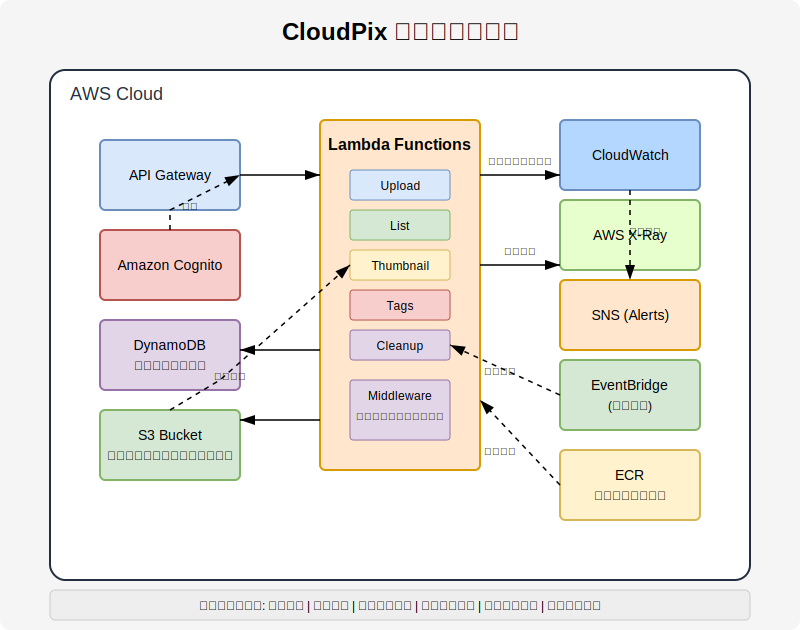

# CloudPix - サーバーレス画像管理システム

CloudPixは、AWSのサーバーレスサービスを活用した画像のアップロードと管理を行うシステムです。画像のアップロード、保存、メタデータ管理、一覧取得、自動サムネイル生成に加え、画像へのタグ付けと検索機能を備えています。

## アーキテクチャ図



## 必要なライブラリとツール

このプロジェクトを実行するには、以下のツールが必要です：

- **AWS CLI** - AWSリソースの操作とAPI呼び出し用
- **Go** - Goプログラミング言語（バージョン1.22以上推奨）
- **go.uber.org/mock/mockgen** - テスト用モックコード生成ツール
- **jq** - JSONデータ処理ツール
- **make** - Makefileからコマンドを実行するためのビルドツール

## クリーンアーキテクチャの採用

本プロジェクトはクリーンアーキテクチャの原則に従って実装されています。

### アーキテクチャ層の構成

```
cloudpix/
  ├── cmd/                 # エントリーポイント
  │   ├── upload/          # 画像アップロード機能
  │   ├── list/            # 画像一覧取得機能
  │   ├── thumbnail/       # サムネイル生成機能
  │   └── tags/            # タグ管理機能
  ├── internal/            # 内部パッケージ
  │   ├── domain/          # ドメイン層
  │   │   ├── imagemanagement/   # 画像管理ドメイン
  │   │   ├── thumbnailmanagement/ # サムネイル管理ドメイン
  │   │   ├── tagmanagement/     # タグ管理ドメイン
  │   │   ├── authmanagement/    # 認証管理ドメイン
  │   │   └── shared/            # 共有コンポーネント
  │   ├── application/     # アプリケーション層（ユースケース）
  │   │   ├── imagemanagement/   # 画像管理ユースケース
  │   │   ├── thumbnailmanagement/ # サムネイル管理ユースケース
  │   │   ├── tagmanagement/     # タグ管理ユースケース
  │   │   └── authmanagement/    # 認証管理ユースケース
  │   ├── infrastructure/  # インフラストラクチャ層
  │   │   ├── persistence/ # DynamoDB実装
  │   │   ├── storage/     # S3実装
  │   │   ├── imaging/     # 画像処理実装
  │   │   ├── auth/        # 認証実装
  │   │   └── metrics/     # メトリクス収集
  │   └── adapter/         # アダプター層
  │       ├── api/         # APIハンドラー
  │       ├── event/       # イベントハンドラー
  │       └── middleware/  # ミドルウェア（認証、ロギング、メトリクス等）
  ├── config/              # 設定
  └── terraform/           # インフラストラクチャコード
```

## 主要コンポーネント

### 1. API Gateway
- RESTful APIエンドポイントを提供
- Cognito認証によるアクセス制御
- `/upload` - 画像アップロード用エンドポイント
- `/list` - 画像一覧取得用エンドポイント
- `/tags` - タグ管理用エンドポイント
- `/tags/{imageId}` - 特定画像のタグ管理用エンドポイント

### 2. Lambda 関数
- **cloudpix-upload** - 画像アップロード、S3保存、メタデータ登録を行う関数
- **cloudpix-list** - DynamoDBからメタデータを取得し画像一覧を提供する関数
- **cloudpix-thumbnail** - アップロードされた画像のサムネイルを自動生成する関数
- **cloudpix-tags** - 画像のタグを追加・削除・一覧取得する関数

### 3. S3バケット
- **cloudpix-images-{random_suffix}** - アップロードされた画像を保存
  - `uploads/` - 元の画像ファイル
  - `thumbnails/` - 自動生成されたサムネイル

### 4. DynamoDBテーブル
- **cloudpix-metadata** - 画像のメタデータを保存
  - `ImageID` (パーティションキー) - 画像の一意識別子
  - `UploadDate` (GSIキー) - アップロード日付によるクエリを可能にする
  - `Owner` (GSIキー) - ユーザーIDによるクエリを可能にする
  - サムネイル情報も同じレコードに保存
- **cloudpix-tags** - 画像のタグ情報を保存
  - `TagName` (パーティションキー) - タグ名
  - `ImageID` (ソートキー) - 画像の一意識別子
  - `ImageIDIndex` (GSI) - 画像IDからタグを検索するためのインデックス

### 5. S3イベント通知
- 画像がアップロードされると自動的にサムネイル生成関数を起動

### 6. ECRリポジトリ
- **cloudpix-upload** - アップロード関数用のコンテナイメージを格納
- **cloudpix-list** - 一覧表示関数用のコンテナイメージを格納
- **cloudpix-thumbnail** - サムネイル生成関数用のコンテナイメージを格納
- **cloudpix-tags** - タグ管理関数用のコンテナイメージを格納

### 7. 認証システム (Amazon Cognito)
- **ユーザープール** - ユーザーの登録、認証、管理
- **クライアントアプリ** - フロントエンドアプリケーション用の認証設定
- **ユーザーグループ**
  - Administrators - 管理者権限
  - PremiumUsers - プレミアムユーザー
  - StandardUsers - 一般ユーザー
- **JWT認証** - JWTトークンを使用したAPIアクセス制御

### 8. メトリクス収集と監視
- **CloudWatch Logs** - 構造化ログ記録
- **CloudWatch Metrics** - カスタムメトリクス収集
- **CloudWatch Alarms** - 異常検知とアラート通知
- **CloudWatch Dashboard** - リアルタイムメトリクス可視化
- **X-Ray** - 分散トレーシング

## ドメインモデル

### 主要なドメインモデル

#### 画像管理
- **Image**: 画像情報を表すエンティティ
- **ImageAggregate**: 画像に関連する情報を集約したアグリゲート
- **FileName, ContentType, ImageSize, UploadDate**: 画像に関する値オブジェクト
- **StorageService**: 画像ストレージサービスインターフェース
- **ImageRepository**: 画像リポジトリインターフェース

#### サムネイル管理
- **Thumbnail**: サムネイル情報を表すエンティティ
- **Dimensions, ImageData**: サムネイルに関する値オブジェクト
- **ImageProcessingService**: 画像処理サービスインターフェース
- **ThumbnailRepository**: サムネイルリポジトリインターフェース

#### タグ管理
- **TaggedImage**: タグ付き画像を表すエンティティ
- **Tag**: タグを表す値オブジェクト
- **TagRepository**: タグリポジトリインターフェース

#### 認証管理
- **User**: ユーザー情報を表すエンティティ
- **UserID, Credentials**: ユーザー関連の値オブジェクト
- **AuthService**: 認証サービスインターフェース
- **AuthRepository**: 認証リポジトリインターフェース

### イベント駆動型設計
- **DomainEvent**: ドメインイベントインターフェース
- **EventDispatcher**: イベントディスパッチャーインターフェース
- **EventHandler**: イベントハンドラーインターフェース
- **ImageUploadedEvent**: 画像アップロード完了イベント
- **ThumbnailGeneratedEvent**: サムネイル生成完了イベント
- **TagsUpdatedEvent**: タグ更新完了イベント

## 認証フロー

1. ユーザーはCognitoのホスト型UIまたはフロントエンドアプリケーションを通じてログイン
2. 認証成功後、JWTトークン（ID、アクセス、リフレッシュ）を取得
3. APIリクエスト時、AuthorizationヘッダーにBearerトークンを付与
4. Lambda関数内の認証ミドルウェアがトークンを検証
5. トークンの検証は以下を含む:
   - トークンの署名検証（JWKSを使用）
   - 発行者、オーディエンス、有効期限の確認
   - ユーザー情報とグループ所属の取得
6. 認証成功後、ユーザー情報がコンテキストに追加され、リクエスト処理が続行

## 実装機能

- **ユーザー認証と承認** - Cognitoを使用したユーザー登録、認証、アクセス制御
- **ユーザーグループ** - 管理者、プレミアムユーザー、一般ユーザーの権限分け
- **画像アップロード** - Base64エンコードされた画像データをアップロード
- **プレサインドURL** - S3への直接アップロード用URLの生成
- **メタデータ管理** - 画像のファイル名、サイズ、コンテンツタイプなどを管理
- **画像一覧取得** - アップロードされた画像の一覧取得
- **日付フィルタリング** - アップロード日付による画像の絞り込み
- **自動サムネイル生成** - 画像アップロード時にサムネイルを自動生成
- **イベント駆動型処理** - S3イベント通知による非同期処理
- **タグ管理機能** - 画像へのタグ付け、タグの一覧取得、タグによる画像検索
- **タグ検索** - タグに基づいて画像をフィルタリング
- **包括的なメトリクス収集** - CloudWatchを使用した詳細なパフォーマンスメトリクスとモニタリング
- **構造化ロギング** - JSON形式の構造化ログでリクエスト追跡と問題診断を強化
- **分散トレーシング** - AWS X-Rayによる関数間の呼び出し追跡
- **アラート通知** - 重要な問題が発生した際のSNS通知

## コマンド一覧

```bash
# インフラのデプロイ
make tf-apply

# アプリケーションテスト関連

## 単体テスト実行
make go-test

## 詳細出力付きの単体テスト実行
make go-test-verbose

## テストカバレッジレポートの生成
make go-test-coverage

# APIのテスト

## 認証処理を含む画像アップロードテスト
make api-test-upload

## 画像一覧取得テスト
make api-test-list

## 特定の日付の画像一覧取得テスト
make api-test-list-date

## タグ追加テスト
make api-test-add-tags

## 画像のタグ取得テスト
make api-test-get-image-tags

## すべてのタグリスト取得テスト
make api-test-list-tags

## タグによる画像検索テスト
make api-test-search-by-tag

# Lambda関数コード更新

## アップロード関数のコード更新
make update-code

## リスト関数のコード更新
make update-list-code

## サムネイル関数のコード更新
make update-thumbnail-code

## タグ管理関数のコード更新
make update-tags-code
```

## プロジェクトのセットアップと実行

### 環境のセットアップ

1. 必要なツールのインストール:
   ```bash
   # AWS CLIのインストールと設定
   aws configure
   
   # Terraformのインストール
   # https://learn.hashicorp.com/tutorials/terraform/install-cli
   ```

2. 環境変数の設定:
   ```bash
   # terraform.tfvars ファイルの作成
   cd terraform
   make tf-init-env
   # 作成されたterraform.tfvarsファイルを適切に編集
   ```

### インフラストラクチャのデプロイ

```bash
# Terraformの初期化
make tf-init

# 変更内容の確認
make tf-plan

# インフラのデプロイ
make tf-apply
```

### アプリケーションのテスト

デプロイ後、以下のコマンドでAPIが正常に機能していることを確認できます:

```bash
# 画像アップロードのテスト
make api-test-upload

# アップロードされた画像の一覧取得
make api-test-list
```

## 設計上の考慮点

- **ドメイン駆動設計**: ビジネスドメインに焦点を当てたモデリングを採用
- **クリーンアーキテクチャ**: 関心事の分離とテスト容易性を重視
- **イベント駆動アーキテクチャ**: 非同期処理による疎結合なシステム設計
- **マイクロサービス**: 各機能を独立したLambda関数として実装
- **Infrastructure as Code**: Terraformによるインフラの完全自動化
- **詳細なモニタリング**: トラブルシューティングと性能最適化のため

## 今後の拡張予定

- 画像処理機能の拡張（リサイズ、フィルター適用など）
- 詳細なアクセス制御（所有者ベースの権限管理）
- フロントエンドインターフェース
- 複雑な検索クエリ（複数タグの組み合わせなど）
- バッチ処理機能（定期的なクリーンアップなど）
- メトリクス収集と監視機能の強化
- ソーシャルログイン連携（Google、Facebook等）
